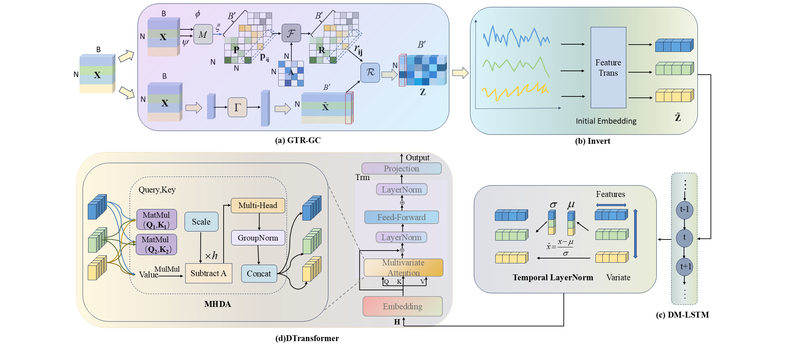

# GCIDM-DTransformer  
*A Multi-Level Spatiotemporal Feature Fusion Framework for Soft Sensor Modeling in Industrial Processes*  
*(Accepted at KDD 2025 Research Track)*  

[](https://www.python.org/) [](https://pytorch.org/)
## Overview
<div  align="center">    
    
</div>
<div  align="center">    
      Figure 1 :Architecture of the CGIDM-DTransformer Model .
</div>

## Dependencies

| Environment | Version / Package                             |
|-------------|-----------------------------------------------|
| **Python**       | ≥ 3.9                                    |
| **PyTorch**      | ≥ 1.13.1                                 |
| **scikit-learn** | ≥ 1.3.2                                  |
| **scipy**        | ≥ 1.11.4                                 |
| **Others**  | numpy, tensorboard, openssl, oauthlib         |

[//]: # (```bash)

[//]: # (# Conda &#40;recommended&#41;)

[//]: # (conda env create -f env.yml)

[//]: # (conda activate gcidm)

## Dataset

| Name | #Samples | Sensors | Target |  
|------|---------:|---------|--------|
| Debutanizer | 2 394 | 7 | Butane | 
| SRU | 10 081 | 5 | SO2 | 

---


## Quick Example — Debutanizer
### 1 · Train
```bash
  # Train
python train.py --dataset 
